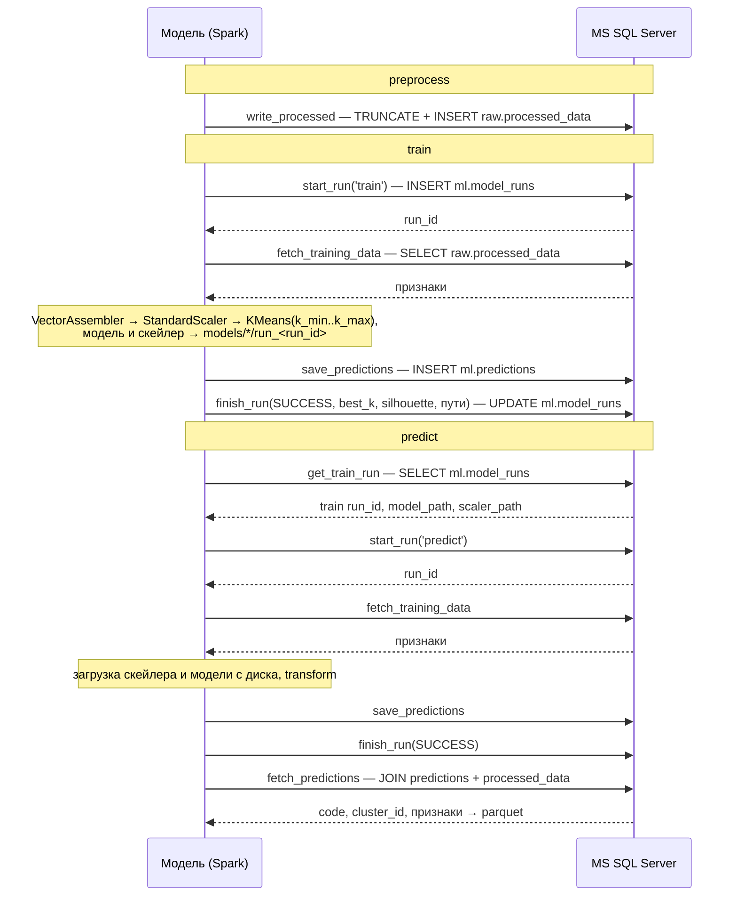

# Lab 6: PySpark KMeans на Open Food Facts + MS SQL Server

Кластеризация продуктов Open Food Facts по пищевой ценности (на 100г) с помощью Spark ML KMeans.
Очищенные данные, журнал запусков и предсказания хранятся в MS SQL Server; модель работает с базой
через Spark JDBC и `pymssql`.

## Установка

Секреты для базы — в `.env` в корне проекта (шаблон — [`.env.example`](.env.example)):

```bash
cp .env.example .env
```

Положите сырой датасет в `data/en.openfoodfacts.org.products.csv` (путь задаётся в `src/config.json` → `data.raw_path`).

### Через Docker (рекомендуется)

```bash
docker compose up -d mssql mssql-init
```

`mssql-init` прогоняет [`docker/mssql/init/schema.sql`](docker/mssql/init/schema.sql) — скрипт идемпотентен,
повторный запуск на существующей базе безопасен. Данные базы лежат в volume `mssql-data` и переживают
`docker compose down` (удалить: `docker compose down -v`).

### Локально

Нужна Java (Spark — JVM-приложение) и поднятый контейнер `mssql`:

```bash
brew install openjdk@17
export JAVA_HOME=/opt/homebrew/opt/openjdk@17

python3 -m venv .venv
source .venv/bin/activate
pip install -r requirements.txt

set -a; source .env; set +a
```

## Конфигурация

Все настройки — в [`src/config.json`](src/config.json): пути к данным/артефактам (`data`), какие колонки брать (`features`),
как считается размер сэмпла (`sampling`), параметры модели (`model`, включая диапазон `k`), подключение к базе (`datasource`).
Ресурсы машины (ядра, RAM) не задаются вручную — определяются в рантайме (`src/spark_session.py`), конфиг лишь ограничивает,
сколько от них брать.

Переменные окружения важнее конфига: `MSSQL_HOST` / `MSSQL_PORT` переопределяют `datasource.host` / `datasource.port`
(в docker compose база доступна по имени сервиса `mssql`), `MSSQL_USER` / `MSSQL_PASSWORD` обязательны.

## Запуск

```bash
# 1. Предобработка: сырой CSV -> отбор колонок -> очистка -> сэмпл -> raw.processed_data
docker compose run --rm app preprocess

# 2. Обучение: подбор k по silhouette, модель/скейлер на диск, предсказания и метрики в базу
docker compose run --rm app train

# 3. Инференс моделью последнего успешного обучения (или конкретного: --run-id N)
docker compose run --rm app predict --output data/processed/predictions.parquet
```

Локально те же команды: `python src/main.py preprocess|train|predict`.

Результаты:
- `raw.processed_data` — очищенная выборка признаков
- `ml.model_runs` — журнал запусков со статусом, метриками и путями к артефактам
- `ml.predictions` — номер кластера для каждого продукта в разрезе запуска
- `models/kmeans/run_<run_id>`, `models/scaler/run_<run_id>` — обученные артефакты
- `reports/preprocess_report.json` — сколько строк отсеялось на каждом шаге очистки
- `data/processed/predictions.parquet` — выгрузка предсказаний `predict` вместе с признаками

## Протокол взаимодействия между моделью и источником данных

### Стороны и транспорт

| | |
|---|---|
| Роли | Модель (Spark-приложение, [`src/datasource.py`](src/datasource.py) → `MsSqlDataSource`) — активная сторона, всегда инициатор. Источник (MS SQL Server 2022, база `OpenFoodDB`) — пассивная сторона, только отвечает на запросы. |
| Транспорт | TDS поверх TCP, порт 1433. |
| Массовые операции | Spark JDBC, драйвер `com.microsoft.sqlserver:mssql-jdbc:12.8.1.jre11`, URL `jdbc:sqlserver://<host>:<port>;databaseName=OpenFoodDB;encrypt=true;trustServerCertificate=true`. |
| Одиночные операции | `pymssql`: одно соединение на запрос, явный `commit`. Используется там, где нужен результат запроса (например, сгенерированный `run_id`) — Spark JDBC возвращать сгенерированные ключи не умеет. |
| Аутентификация | SQL Server Authentication, логин и пароль из `MSSQL_USER` / `MSSQL_PASSWORD`. |

### Единица взаимодействия — запуск (run)

Каждый `train` и `predict` — это запуск: строка в `ml.model_runs` с целочисленным `run_id`, который выдаёт база
(`IDENTITY`). Запуск открывается до чтения данных со статусом `RUNNING` и закрывается статусом `SUCCESS` или `FAILED`.
Все предсказания привязаны к `run_id`, поэтому результаты разных запусков не перезаписывают друг друга.

```
RUNNING ──(все шаги прошли)──> SUCCESS
   └─────(любое исключение)──> FAILED  (error_message = repr(exc), до 1000 символов)
```

### Операции

| Операция | Команда | Канал | SQL | Назначение |
|---|---|---|---|---|
| `write_processed` | preprocess | Spark JDBC, `overwrite` + `truncate`, `batchsize=10000` | `TRUNCATE` + `INSERT` в `raw.processed_data` | Загрузить очищенную выборку |
| `get_train_run` | predict | pymssql | `SELECT TOP 1 … FROM ml.model_runs WHERE command='train' AND status='SUCCESS'` | Найти модель для инференса (указанный или последний `run_id`) |
| `start_run` | train, predict | pymssql | `INSERT INTO ml.model_runs … OUTPUT INSERTED.run_id` | Открыть запуск, получить `run_id` |
| `fetch_training_data` | train, predict | Spark JDBC, `fetchsize=10000` | `SELECT product_id, code, <признаки> FROM raw.processed_data WHERE <признаки> IS NOT NULL` | Получить признаки |
| `save_predictions` | train, predict | Spark JDBC, `append`, `batchsize=10000` | `INSERT INTO ml.predictions` | Сохранить кластеры запуска |
| `finish_run` | train, predict | pymssql | `UPDATE ml.model_runs SET status, finished_at, rows_in, best_k, best_silhouette, params, …` | Закрыть запуск с метриками или ошибкой |
| `fetch_predictions` | predict | Spark JDBC | `SELECT … FROM ml.predictions p JOIN raw.processed_data d ON d.code = p.code WHERE p.run_id = ?` | Прочитать результат запуска с признаками для выгрузки в parquet |

Параллельное чтение: при `datasource.num_partitions > 1` модель сначала запрашивает
`MIN(product_id), MAX(product_id)` и читает таблицу в N параллельных запросов по диапазонам `product_id`;
при `1` — одним запросом.

### Последовательность



При исключении на любом шаге после `start_run` модель выполняет `finish_run(FAILED)` и пробрасывает ошибку дальше.

## Формат хранения данных

Схема создаётся [`docker/mssql/init/schema.sql`](docker/mssql/init/schema.sql) и разделена на две SQL-схемы:
`raw` — входные данные модели, `ml` — всё, что производит модель.

### Особенности источника и решения под них

- **Реляционная СУБД, строгая типизация.** В исходном TSV Open Food Facts ~200 колонок, все строковые.
  В базу попадают только `code` и 7 числовых признаков на 100г, уже приведённые к `FLOAT`, — таблица узкая,
  а Spark JDBC не тратит время на разбор строк.
- **Идентификаторы SQL Server.** Дефис в имени колонки потребовал бы кавычек в каждом запросе, поэтому
  `energy-kcal_100g` и `saturated-fat_100g` хранятся как `energy_kcal_100g` и `saturated_fat_100g`;
  переименование туда и обратно делает `MsSqlDataSource` (`CONFIG_TO_DB`), конфиг и модель продолжают
  работать с исходными именами.
- **Параллельное чтение Spark JDBC** требует числовой колонки с монотонным диапазоном значений — для этого
  в `raw.processed_data` есть суррогатный ключ `product_id INT IDENTITY` (штрихкод `code` строковый и
  для партиционирования не подходит).
- **Штрихкод как ключ товара.** `code` ограничен `NVARCHAR(64)`, чтобы участвовать в первичном ключе `ml.predictions`;
  на предобработке строки с пустым или длиннее 64 символов `code` отбрасываются, дубликаты по `code` удаляются.
- **Модели Spark ML не хранятся в базе.** Это каталоги с метаданными и parquet, поэтому они лежат на диске
  (`models/`, примонтирован в контейнер), а в `ml.model_runs` записываются пути к ним. База остаётся
  единственным местом, где связаны запуск, его метрики и его артефакты.
- **Гибкие параметры запуска.** Диапазон `k`, список признаков, silhouette по каждому `k`, путь к модели,
  `train_run_id` у инференса — набор разный для `train` и `predict`, поэтому хранится в одной колонке
  `params NVARCHAR(MAX)` в формате JSON (`CHECK ISJSON`), а читается средствами SQL Server (`JSON_VALUE`).

### `raw.processed_data` — очищенная выборка признаков

| Колонка | Тип | Описание |
|---|---|---|
| `product_id` | `INT IDENTITY` PK | Суррогатный ключ, колонка партиционирования при чтении |
| `code` | `NVARCHAR(64) NOT NULL` | Штрихкод товара, уникален в выборке |
| `energy_kcal_100g` | `FLOAT NULL` | Энергетическая ценность, ккал |
| `fat_100g` | `FLOAT NULL` | Жиры, г |
| `saturated_fat_100g` | `FLOAT NULL` | Насыщенные жиры, г |
| `carbohydrates_100g` | `FLOAT NULL` | Углеводы, г |
| `sugars_100g` | `FLOAT NULL` | Сахара, г |
| `proteins_100g` | `FLOAT NULL` | Белки, г |
| `salt_100g` | `FLOAT NULL` | Соль, г |

Перезаписывается целиком при каждом `preprocess`. Строк с `NULL` в признаках предобработка не пишет, но
`fetch_training_data` дополнительно фильтрует их на стороне базы.

### `ml.model_runs` — журнал запусков

| Колонка | Тип | Описание |
|---|---|---|
| `run_id` | `INT IDENTITY` PK | Идентификатор запуска |
| `command` | `NVARCHAR(16) NOT NULL` | `train` или `predict` |
| `status` | `NVARCHAR(16) NOT NULL`, `CHECK IN ('RUNNING','SUCCESS','FAILED')` | Состояние запуска |
| `started_at` | `DATETIME2(3) NOT NULL` | Время открытия (`SYSDATETIME()`) |
| `finished_at` | `DATETIME2(3) NULL` | Время закрытия |
| `rows_in` | `INT NULL` | Сколько строк получено из источника |
| `best_k` | `INT NULL` | Выбранное `k` (у `predict` — `k` применённой модели) |
| `best_silhouette` | `FLOAT NULL` | Silhouette лучшей модели (только `train`) |
| `params` | `NVARCHAR(MAX) NULL`, `CHECK ISJSON` | Параметры и доп. метрики запуска |
| `scaler_path` | `NVARCHAR(500) NOT NULL` | Путь к скейлеру на диске |
| `error_message` | `NVARCHAR(1000) NULL` | Текст ошибки для `FAILED` |

Пример `params` у успешного `train`:

```json
{
  "k_min": 2,
  "k_max": 10,
  "features": ["energy-kcal_100g", "fat_100g", "..."],
  "silhouette_by_k": [{"k": 2, "silhouette": 0.61}, {"k": 3, "silhouette": 0.54}],
  "model_path": "models/kmeans/run_1"
}
```

У `predict`: `{"train_run_id": 1, "model_path": "models/kmeans/run_1"}`.

### `ml.predictions` — кластеры товаров

| Колонка | Тип | Описание |
|---|---|---|
| `run_id` | `INT NOT NULL`, FK → `ml.model_runs(run_id)` `ON DELETE CASCADE` | Запуск, в котором получено предсказание |
| `code` | `NVARCHAR(64) NOT NULL` | Штрихкод товара |
| `cluster_id` | `INT NOT NULL` | Номер кластера |

Первичный ключ — кластеризованный `(run_id, code)`: строки одного запуска лежат физически рядом, поэтому
выборка `WHERE run_id = ?` читает непрерывный диапазон, а повторная запись того же товара в тот же запуск
отклоняется базой. Удаление запуска из `ml.model_runs` каскадно удаляет его предсказания.
Признаки в `ml.predictions` не дублируются — при необходимости они подтягиваются `JOIN` с `raw.processed_data` по `code`.
